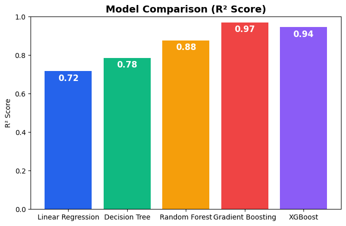
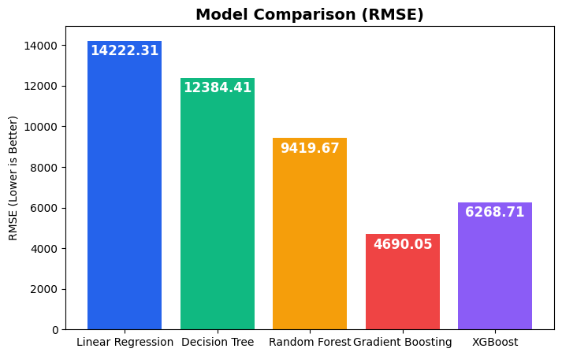

# 💼 Employee Salary Prediction Web App

[](https://www.kaggle.com/datasets/rkiattisak/salaly-prediction-for-beginer)
[](https://employe-salary-prediction-using-ml.streamlit.app/)

A **Machine Learning-powered web application** that predicts employee salaries based on **Age**, **Gender**, **Education Level**, **Job Title**, and **Years of Experience**.
Built using **Streamlit** with an elegant dark UI and multiple regression models.

---

## ✅ Features

✔ Predict salary using **5 ML Models**:

* Linear Regression
* Decision Tree
* Random Forest
* Gradient Boosting
* XGBoost

✔ Interactive **Streamlit UI** with model selection
✔ Displays **Estimated Annual Salary** instantly
✔ **Model comparison charts (R² & RMSE)** for presentation
✔ Pre-trained models for **fast predictions**

---

## 📊 Input Features

* Age
* Gender
* Education Level
* Job Title
* Years of Experience

---

## 🛠 Tech Stack

| Layer          | Tools Used                                                                  |
| -------------- | --------------------------------------------------------------------------- |
| **Frontend**   | Streamlit                                                                   |
| **ML Models**  | Linear Regression, Decision Tree, Random Forest, Gradient Boosting, XGBoost |
| **Data Prep**  | Pandas, NumPy, LabelEncoder, StandardScaler                                 |
| **Deployment** | Streamlit Cloud                                                             |

---

## 🔍 Model Performance

| Model             | R² Score |     RMSE |
| ----------------- | -------: | -------: |
| Linear Regression |   0.7163 | 14222.31 |
| Decision Tree     |   0.7849 | 12384.41 |
| Random Forest     |   0.8756 |  9419.67 |
| Gradient Boosting |   0.9692 |  4690.05 |
| XGBoost           |   0.9449 |  6268.71 |

---


### 📈 Performance Charts

**Model Comparison (R² Score)**


**RMSE Comparison**


---


## ⚙️ Setup Instructions

### 1. Clone the Repository

```bash
git clone https://github.com/sharavana07/salarypredicationAICTE.git
cd salarypredicationAICTE
```

### 2. Create a Virtual Environment

```bash
python -m venv venv

# Activate
# Windows:
venv\Scripts\activate
# Mac/Linux:
source venv/bin/activate
```

### 3. Install Dependencies

```bash
pip install -r requirements.txt
```

### 4. Run Locally

```bash
streamlit run app.py
```

---

## 📦 Deployment on Streamlit Cloud

1. Push your code to **GitHub**
2. Go to [Streamlit Cloud](https://streamlit.io/cloud)
3. **Connect your GitHub repo** and deploy
4. Set **Python version**: `3.10+`
5. Add `requirements.txt` in **Packages**

---

## 📂 Project Structure

```
salarypredicationAICTE/
│
├── app.py                   # Streamlit App
├── train_and_save_models.py # Training script
├── all_salary_models.pkl    # All pre-trained models
├── employee_salary_data.csv # Dataset
├── requirements.txt         # Dependencies
├── images/                  # Model comparison charts
│   ├── model_comparison.png
│   ├── rmse_comparison.png
└── README.md
```


## 📜 License

This project is for **educational purposes** and internship demonstration. All rights reserved by the author.

---
